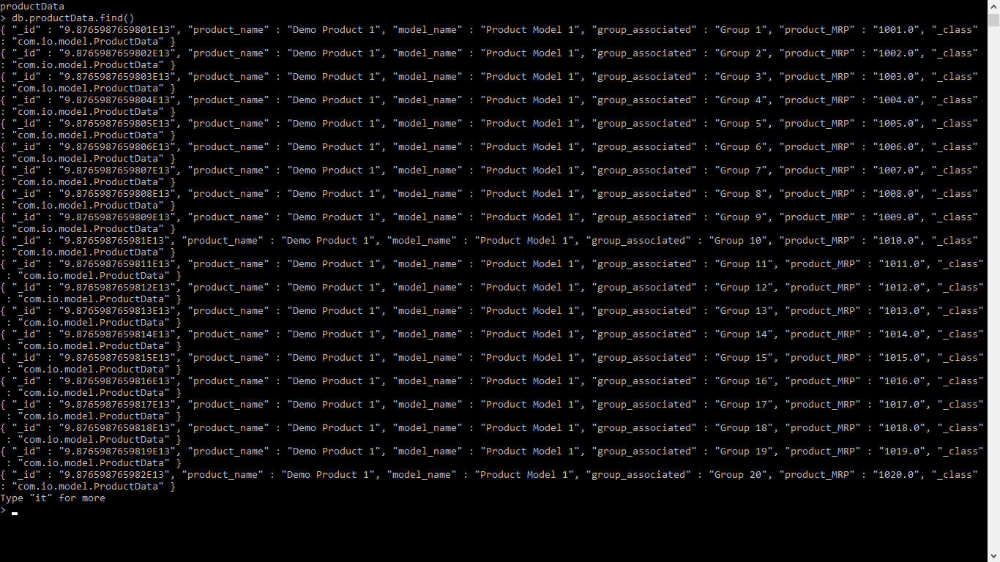

# Assignment2
MyDukan Data Analytics Engineer Assignment2

# About
This is a Springboot application, In which I have followed the Spring MVC structure.

# Task
The main and only task of this application is to fetch data from an Excel sheet and store the data into the database(I have used MongoDb here).

# Working
To perform the task we have to run this application as a Springboot app And have to make an API call from the browser with the following endpoints
-->   "http://localhost:8082/copy-data".

#
After the successful operation, it will show the following text on the browser window.
--->Data copied from Excel to Database(MongoDb) Successfully.......
# 
During this, it will fetch data from the Excel sheet and insert that data into the database(MongoDb).

# Note
You don't have to generate any table in the database. It will generate automatically, You only have to create the database and give the database name in the application.properties file.

#Result
After this, output in my database is as follows:-

